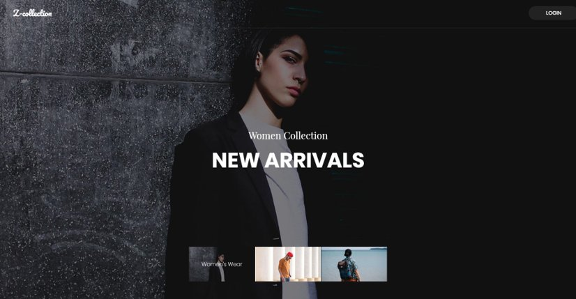
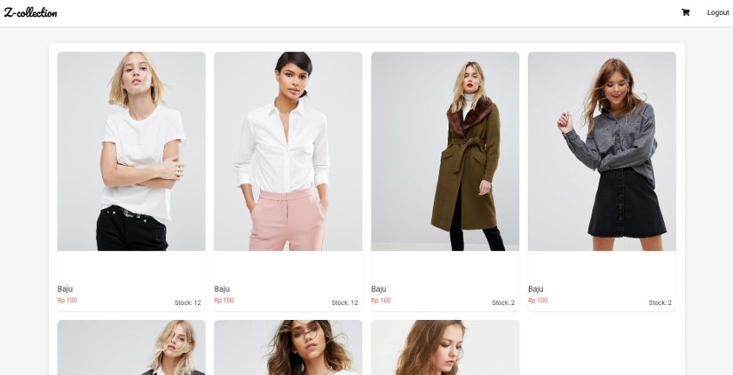
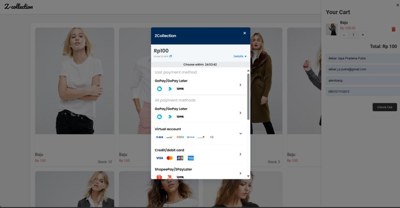
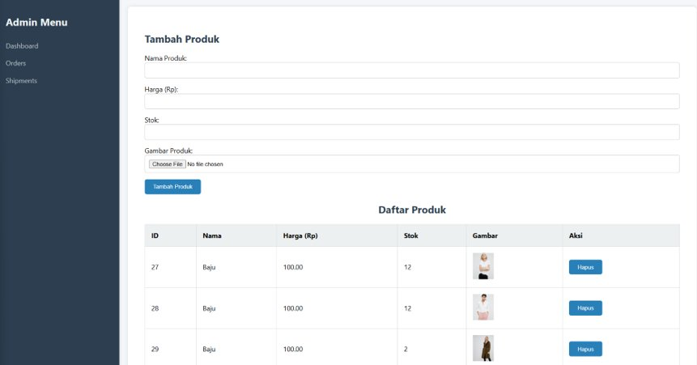

# Zulffaya — Clothing Store 🛍️

A complete full-stack e-commerce platform for a clothing store, built solo from scratch as a final project.

## ✨ Features

- 🛒 Customer storefront with product catalogue & categories
- 🛍️ Shopping cart with quantity management
- 👤 User authentication (register & login)
- 💳 Live payment gateway integration via **Midtrans** (GoPay, Virtual Account, Credit Card, ShopeePay)
- 📦 Order management with status tracking (pending → success)
- 🔧 Admin dashboard to manage products, stock, and orders
- 📱 Responsive design with Bootstrap

## 🛠️ Tech Stack

| Layer | Technology |
|---|---|
| Frontend | HTML, CSS, Bootstrap, JavaScript |
| Backend | PHP, Laravel |
| Database | MySQL |
| Payment | Midtrans API |
| Version Control | Git / GitHub |

## 📸 Screenshots

### Landing Page


### Product Catalogue


### Payment Gateway (Midtrans)


### Admin Dashboard


## 🚀 How to Run

```bash
git clone https://github.com/AP-143/zulffaya_c.git
cd zulffaya_c
composer install
cp .env.example .env
php artisan key:generate
php artisan migrate
php artisan serve
```

Configure your `.env` with database credentials and Midtrans API keys.

## 👨‍💻 Developer

**Akbar Jaya Pratama Putra**
S1 Informatics — AMIKOM University of Yogyakarta (2024)
[LinkedIn](https://www.linkedin.com/in/akbaarputra) · [GitHub](https://github.com/AP-143)
